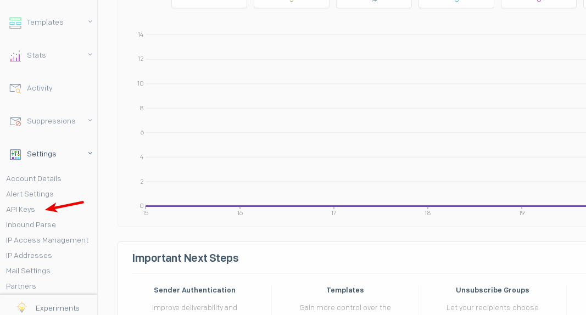

# MVP Sendgrid

<p align="center">
  
</p>


## Descripción

SendGrid, el servicio de entrega de correo electrónico de IBM Cloud, es un servicio de retransmisión de correo electrónico que le permite utiliza un smarthost para retransmitir sus servicios de correo saliente. Un smarthost retransmite tráfico de SMTP de un servidor SMTP, cliente de correo electrónico o cualquier otro servicio o lenguaje de programación capaz de gestionar SMTP. Este servicio también genera métricas, realiza el seguimiento de listas de correo electrónico, realiza el seguimiento de la actividad del correo electrónico, como por ejemplo, correos electrónicos rechazados, pulsados, descartados y abiertos.

## Crear proyecto

-Descargamos Node.js <br>
-Comenzamos el proyecto en Node.js creando una carpeta nombrada 'Envio_mail' y corremos el comando ***npm init***.<br>
-Agregamos en el archivo ***package.json*** en la seccion de ***scripts*** "start": "node sendgrid.js".<br>
-Debemos correr el comando en Node.js: ***npm install @sendgrid/mail***<br>
-Luego creamos un archivo y lo nombramos 'sendgrid.js' a la carpeta. <br>
-Cuando hagamos cambios en el archivo debemos guardarlo y para probar corremos el comando ***npm start***. <br>

Luego debemos tener una cuenta en Sendgrid. Nos dirigimos sobre el panel de la izquierda al item ***settings***

<p align="center">
  
</p>

Y luego generamos una API KEY que es la que vamos a utilizar en nuestro codigo en Node.js

## Envio de Mail usando Sendgrid + Node.js

Envio comun a ***UN DESTINATARIO***

```js
const sgMail = require('@sendgrid/mail');
sgMail.setApiKey(YOUR_API_KEY); //Sustituir APIKEY
const msg = {
  to: 'recipient1@example.org', //cambiar por correo destino
  from: 'sender@example.org', //cambiar por correo propio
  subject: 'Hello world',
  text: 'Hello plain world!',
  html: '<p>Hello HTML world!</p>',
};
sgMail.send(msg);
```

Envio a ***MULTIPLES DESTINATARIOS***

El campo `to` puede contener una serie de destinatarios.

```js
const sgMail = require('@sendgrid/mail');
sgMail.setApiKey(YOUR_API_KEY); //Sustituir APIKEY
const msg = {
  to: ['recipient1@example.org', 'recipient2@example.org'], //cambiar por los correos destino
  from: 'sender@example.org', //cambiar por correo propio
  subject: 'Hello world',
  text: 'Hello plain world!',
  html: '<p>Hello HTML world!</p>',
};
sgMail.send(msg);
```

Si desea enviar múltiples correos electrónicos _individuales_ a múltiples destinatarios donde no se ven las direcciones de correo electrónico de los demás, use `sendMultiple`:

```js
const sgMail = require('@sendgrid/mail');
sgMail.setApiKey(YOUR_API_KEY); //Sustituir APIKEY
const msg = {
  to: ['recipient1@example.org', 'recipient2@example.org'],  //cambiar por los correos destino
  from: 'sender@example.org',  //cambiar por correo propio
  subject: 'Hello world',
  text: 'Hello plain world!',
  html: '<p>Hello HTML world!</p>',
};
sgMail.sendMultiple(msg);
```


